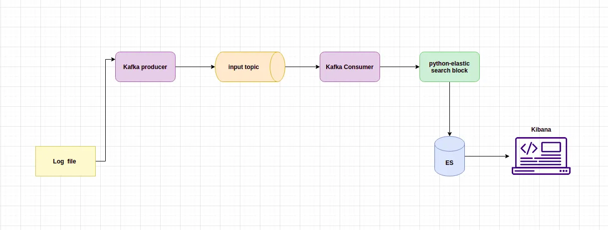

# Dashboard-App

## Stack Used

1. **Apache Kafka**: an extermemly powerful tool when it comes to data stream.

   - It is highlt scalable and reliable
   - []`confluent_kafka`](https://github.com/confluentinc/confluent-kafka-python)

2. **Elasticsearch**: a search engine based on the leucine library.

   - It provides a distributed, full text search engine with an HTTP web interface and schema-free JSON documents.
   - [Python ElasticSearch](https://elasticsearch-py.readthedocs.io/en/v7.13.0/)

3. **Kibana**: an excellent tool for visualising the contents of our elasticsearch database/index.

   - It helps us in building dashboards very quickly.

4. **Python**: very versatile language, and one of the popular languages of 2023

## What we'll be doing and the architecture?

- to simulate a streaming data source we will be using a log file containing random system logs and we will be pushing this information to a kafka topic
- architecture of the entire system
  
